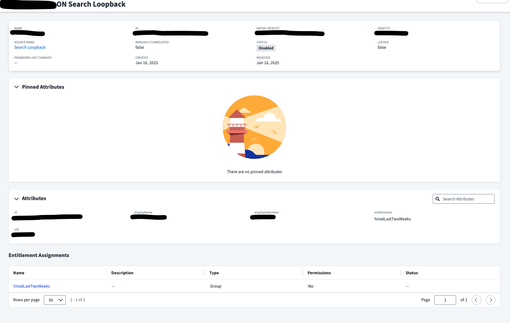
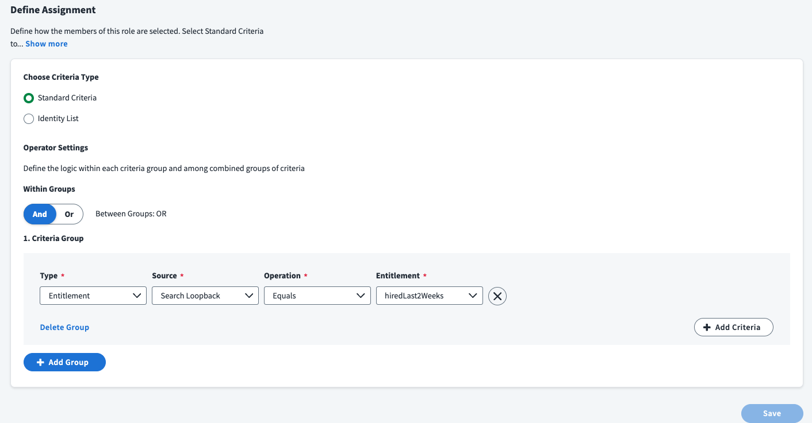

[![Discourse Topics][discourse-shield]][discourse-url]
[![Issues][issues-shield]][issues-url]
[![Latest Releases][release-shield]][release-url]
[![Contributor Shield][contributor-shield]][contributors-url]

[discourse-shield]:https://img.shields.io/discourse/topics?label=Discuss%20This%20Tool&server=https%3A%2F%2Fdeveloper.sailpoint.com%2Fdiscuss
[discourse-url]:https://developer.sailpoint.com/discuss/tag/workflows
[issues-shield]:https://img.shields.io/github/issues/sailpoint-oss/repo-template?label=Issues
[issues-url]:https://github.com/sailpoint-oss/repo-template/issues
[release-shield]: https://img.shields.io/github/v/release/sailpoint-oss/repo-template?label=Current%20Release
[release-url]:https://github.com/sailpoint-oss/repo-template/releases
[contributor-shield]:https://img.shields.io/github/contributors/sailpoint-oss/repo-template?label=Contributors
[contributors-url]:https://github.com/sailpoint-oss/repo-template/graphs/contributors

# ISC Search Loopback Connector

## Overview
SaaS loopback connector that enables you to define entitlements as ISC search queries. Identities returned by each of the configured search queries will have a Search Loopback 'account' and the specified 'entitlement'. If the same identity is returned by multiple different search queries then they will have a single account with multiple entitlements.

Admins can specify they would like to assign the entitlement to the manager of the identities returned by a search query by appending '_manager' to the end of the configured entitlement name. If multiple returned identities have the same manager, the corresponding manager will just have the one entitlement assignment.

## Use Cases
Main use case of this connector is to expand the functionality of role membership criteria. Currently, ISC does not support operations like 'does not contain' or date ranges in the assignment criteria for roles but does allow you to assign roles based on the entitlements an identity is assigned. With this source, you can configure a search query as an entitlement that returns the population of identities you would like to include in your role membership. Then in the criteria mapping, simply configure the corresponding entitlement type to assign the role to those identities. 

### Source Entitlement Config

### Search Loopback Account

### Role Criteria Example

[Explore the docs »](https://your-link-to-colab-topic-here)

[New to the CoLab? Click here »](https://developer.sailpoint.com/discuss/t/about-the-sailpoint-developer-community-colab/11230)

<!-- CONTRIBUTING -->
## Contributing

Contributions are what make the open source community such an amazing place to learn, inspire, and create. Any contributions you make are **greatly appreciated**.

If you have a suggestion that would make this better, please fork the repo and create a pull request. You can also simply open an issue with the tag `enhancement`.
Don't forget to give the project a star! Thanks again!

1. Fork the Project
2. Create your Feature Branch (`git checkout -b feature/AmazingFeature`)
3. Commit your Changes (`git commit -m 'Add some AmazingFeature'`)
4. Push to the Branch (`git push origin feature/AmazingFeature`)
5. Open a Pull Request

<!-- LICENSE -->
## License

Distributed under the MIT License. See `LICENSE.txt` for more information.

<!-- CONTACT -->
## Discuss
[Click Here](https://developer.sailpoint.com/dicuss/tag/{tagName}) to discuss this tool with other users.
